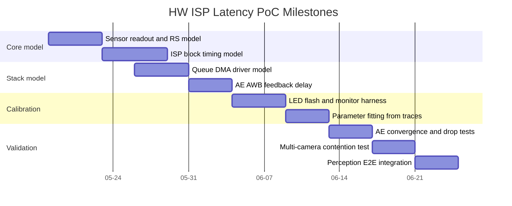

# HW ISP latency simulation 조사

## Executive Summary

이번 조사에서 확인한 공개 자료 기준으로, **sensor readout/rolling shutter, line-buffer 기반 ISP core, frame-buffer 기반 블록, 3A(AE/AWB) feedback delay, DMA/driver queue, multi-camera scheduling, HDR/temporal processing**까지를 한 도구 안에서 동시에 **timing-accurate**하게 다루는 범용 공개 시뮬레이터는 사실상 보이지 않았습니다. 대신 공개 생태계는 크게 세 층으로 나뉩니다. 첫째, **line-buffer/RTL 중심의 ISP core 모델**(예: Darkroom, Mini-ISP, Vitis 계열), 둘째, **request/buffer/3A 지연을 다루는 camera-stack 모델**(예: libcamera, Android HAL3, TIOVX, i.MX95 stack), 셋째, **LED/flash/photodiode 기반 검증 도구와 논문**입니다. 따라서 실무적인 E2E PoC는 단일 툴 채택보다 **“ISP core 모델 + sensor/readout 모델 + queue/driver 모델 + 3A delay 모델 + 실측 기반 calibration”**의 조합이 가장 현실적입니다. citeturn26view1turn7view2turn30view0turn32view1turn35view1turn33view0

정리하면, **학술 쪽 최적의 출발점은 Darkroom**, **오픈소스 단일 후보는 Mini-ISP**, **상용/벤더 문서 쪽 최적 후보는 NvSIPL timing/profiling docs**입니다. 다만 실제 perception E2E 시뮬레이션을 만들 때는 Mini-ISP만으로는 3A/queue/readout이 비고, libcamera/Android/TIOVX만으로는 line-buffer 내부 latency가 비기 때문에, 이들을 **계층적으로 합성**해야 합니다. 공식 1차 자료는 대부분 영문이었고, 한국어 공식 문서는 실질적으로 거의 보이지 않았습니다. citeturn26view1turn37view0turn30view1turn32view0turn33view1turn35view0

## 판단 기준

이 보고서의 **충실도**는 다음 기준으로 정성 평가했습니다. **높음**은 RTL/streaming core 수준이거나, 마이크로초 단위 timestamp/profiling, 혹은 행(row) 단위 readout 모델처럼 시간축이 명시된 경우입니다. **중간**은 frame/request/buffer 수준의 지연은 설명하지만, ISP 블록 내부의 세부 cycle 또는 line-buffer 파이프라인은 직접 모델링하지 않는 경우입니다. **낮음**은 아키텍처와 블록 순서 설명은 유용하지만 timing 파라미터가 거의 없는 경우입니다.

아래 표에서 쓰는 약어는 다음과 같습니다. **LB/FB**는 line-buffer / frame-buffer, **RS**는 rolling shutter/readout, **3A**는 AE/AWB feedback delay, **Q**는 DMA/driver/buffer queue, **MC**는 multi-camera scheduling, **HDR/TNR**은 multi-exposure HDR 또는 temporal noise reduction입니다.

## 자료 카탈로그

**Academic papers**

| 이름 | 유형 | 링크 | 모델링 범위 | 충실도 | 언어/라이선스 | E2E 활용 | 근거 |
|---|---|---|---|---|---|---|---|
| Darkroom | 논문 | url논문turn26view1 | **LB 중심**. line-buffered pipeline을 ILP로 스케줄링하고 Verilog/ASIC/FPGA/CPU로 생성. RS·3A·Q는 없음 | 높음 | 영문 / - | line-buffer 단계별 latency와 on-chip buffering 기준선으로 매우 좋음 | 핵심 citeturn26view1 |
| Programming Heterogeneous Systems from an Image Processing DSL | 논문 | url논문turn28search0 | Halide 기반 HW/SW 분할, accelerator 생성과 “glue code”, throughput mapping. **LB/host-offload** 관점이 강함 | 중상 | 영문 / - | ISP 일부를 accelerator로 떼어 내는 E2E 구조 설계에 유용 | 핵심 citeturn28search0turn28search1 |
| Architectural Analysis of a Baseline ISP Pipeline | 논문/챕터 | urlSpringer 챕터turn13search1 | ISP 기능을 **pixel-based vs frame-based**, Bayer/RGB/YCbCr 도메인으로 정리한 baseline pipeline | 중간 | 영문 / - | 어떤 블록을 LB로, 어떤 블록을 FB로 분리할지 정하는 설계 규칙으로 유용 | 핵심 citeturn13search1turn13search2 |
| Rolling Shutter Camera Synchronization with Sub-Millisecond Accuracy | 논문 | url논문 PDFturn26view2 | **RS 중심**. 행 단위 시간식 `t(f,r)`와 hidden rows를 포함한 sub-frame timing 모델, flash 기반 검증 | 높음 | 영문 / - | row-time, hidden-line, exposure midpoint 모델과 LED flash validation에 직접 사용 가능 | 핵심 citeturn26view2 |
| Verification Method for Time of Capture of a Rolling Shutter Image | 학위논문/논문 | url학위논문 PDFturn26view3 | rolling-shutter timestamp 검증용 **LED/digital-clock 장치**와 PoC. G2G/clock/flash 방법도 정리 | 높음 | 영문 / - | simulator의 ground-truth harness 설계와 validation protocol에 적합 | 핵심 citeturn26view3turn27view0turn27view1turn27view2turn27view3 |

**Open-source projects**

| 이름 | 유형 | 링크 | 모델링 범위 | 충실도 | 언어/라이선스 | E2E 활용 | 근거 |
|---|---|---|---|---|---|---|---|
| libcamera | 프로젝트 | url공식 가이드turn23search7 | **3A/Q/MC 중심**. per-frame request queue, request completion ordering, delayed controls, multistream support. ISP 내부 LB 모델은 없음 | 중간 | 영문 / C/C++ / LGPL-2.1+ | camera-stack의 request/result lag, control apply delay, multistream queue model에 가장 유용 | 핵심 citeturn30view0turn30view1turn30view3turn38view0turn21search0 |
| Mini-ISP | 프로젝트 | url저장소turn6view0 | **LB/RTL 중심**. Verilog RTL, AXI-stream, Python simulation/test bench, `make sim`, 1/2/4 PPC, fully pipelined. AE/AWB/HDR/TNR은 제한적 | 높음 | 영문 / Verilog+Python / MIT | HW ISP core latency를 실제에 가장 가깝게 모사할 오픈소스 출발점 | 핵심 citeturn7view2turn37view0turn37view1 |
| Infinite-ISP ReferenceModel | 프로젝트 | url저장소turn6view1 | fixed-point Python model, video processing, **3A statistics flowing between frames**. queue/readout/cycle model은 약함 | 중간 | 영문 / Python / Apache-2.0 | AE/AWB feedback delay를 frame 단위로 넣은 software PoC에 적합 | 핵심 citeturn7view3turn7view4turn37view2 |
| openISP | 프로젝트 | url저장소turn6view3 | “hardware perspectives”의 Python ISP. W/HDR와 temporal/spatial NF는 **future work**로 명시 | 낮음 | 영문 / Python / MIT | block order와 parameter file 뼈대를 빠르게 만들기 좋지만 timing fidelity는 낮음 | 핵심 citeturn6view3turn37view3 |

**Commercial SDKs and vendor docs**

| 이름 | 유형 | 링크 | 모델링 범위 | 충실도 | 언어/라이선스 | E2E 활용 | 근거 |
|---|---|---|---|---|---|---|---|
| NvSIPL timing/profiling docs | 상용 SDK/벤더 문서 | urltimestamp docturn35view0 / urlprofiling docturn35view1 | **VI/ISP timestamp, EOF fence, task status, module별 init/transmission/submission/execution latency**. pipeline min/max/avg도 제공 | 높음 | 영문 / 벤더 문서 | 실기 trace를 simulator 파라미터로 역추정하는 데 최상 | 핵심 citeturn35view0turn35view1turn35view2 |
| Vitis Vision ISP docs | 상용 SDK/벤더 문서 | urlmultistream docturn8view0 / url24-bit pipeline docturn8view2 | **streaming model**이 기본이며, 24-bit pipeline에 HDR decompand/AEC/AWB/ISP stats 포함. multistream latency estimate 제공 | 중상 | 영문 / 벤더 문서 | HLS 기반 core latency와 multistream 성능 기준선으로 유용 | 핵심 citeturn8view0turn8view2turn8view3 |
| TIOVX + VPAC VISS | 상용 SDK/벤더 문서 | urlgraph pipelining docturn33view0 / urlVISS API docturn33view1 | **Q/MC/HDR/3A** 강점. graph pipeline depth·buffer depth 자동 설정, multi-sensor object array, VISS 1~3 exposure RAW, H3A AEWB/AF 출력 | 높음 | 영문 / 벤더 문서 | multi-camera scheduling, buffer-depth, H3A feedback이 필요한 graph-level sim에 매우 적합 | 핵심 citeturn33view0turn33view1turn34view0 |
| i.MX95 Camera Porting Guide | 벤더 문서 | urlporting guideturn16view0 | **sensor control → raw capture → ISP control → statistics → decoded capture** 흐름, IPA가 thread/process로 동작, 3A 실시간 프로그래밍 | 중간 | 영문 / 벤더 문서 | control-thread/IPA IPC delay를 넣은 Linux camera-stack PoC 설계에 좋음 | 핵심 citeturn16view0turn36view0turn36view2turn36view3 |
| Android Camera HAL3 docs | 프레임워크/벤더 문서 | urlHAL3 docturn32view0 / urlbuffer management docturn32view1 | **Q/driver/app-facing delay** 강점. SHUTTER timestamp, pipeline depth, in-flight requests, buffer-management latency/memory tradeoff | 중상 | 영문 / 프레임워크 문서 | 앱 관점 request-to-result lag, maxBuffers, stream flush 지연 모델에 적합 | 핵심 citeturn32view0turn32view1 |

이 표에서 보듯이, **LB 내부 timing**은 Darkroom/Mini-ISP/Vitis 쪽이 강하고, **3A·request queue·buffer depth**는 libcamera/Android/TIOVX/i.MX95가 강하며, **실기 calibration**은 NvSIPL과 rolling-shutter validation 논문이 강합니다. 즉, 공개 자료는 존재하지만 **한 도구에 모두 모여 있지 않다**는 것이 핵심 결론입니다. citeturn26view1turn37view0turn30view1turn32view1turn33view0turn35view1turn26view2

## 추천 조합

| 구분 | 추천 후보 | 왜 이 후보가 최적인가 | 통합 방식 | 근거 |
|---|---|---|---|---|
| Academic | urlDarkroomturn26view1 | line-buffered ISP를 가장 명시적으로 모델링하고, buffering 최소화와 hardware generation까지 연결된다 | PoC의 **streaming ISP core** 기준 모델로 채택하고, stage별 line-buffer 높이·window·throughput을 여기서 정의 | 핵심 citeturn26view1 |
| Open-source | urlMini-ISPturn6view0 | 공개된 것 중 **가장 HW ISP core에 가까운 형태**다. RTL, Verilator test bench, Python simulation이 모두 있다 | RAW 입력을 RTL/Python으로 통과시키고, 그 위에 libcamera/Android식 **queue·3A delay layer**를 덧댄다 | 핵심 citeturn37view0turn37view1turn30view1turn32view1 |
| Commercial/vendor | urlNvSIPL timing/profilingturn35view1 | 공개 벤더 자료 중 **timestamp와 profiling granularity**가 가장 직접적이다. microsecond fence timestamp와 module latency가 있다 | 가능하면 실제 장비에서 trace를 덤프해 simulator의 readout/submission/execution 분포를 fit한다 | 핵심 citeturn35view0turn35view1 |

보완적으로는, **graph-level multi-camera와 HDR/WDR**가 핵심이면 TIOVX가, **Linux 사용자 공간 3A/IPA 구조를 현실적으로 따르려면** libcamera+i.MX95 문서 조합이 좋습니다. 반대로 “알고리즘만 빨리 훑어보기”가 목적이면 Infinite-ISP나 openISP가 도움이 되지만, 이 둘만으로는 latency PoC가 약합니다. citeturn33view1turn34view0turn30view0turn36view0turn7view3turn6view3

## 최소 PoC 설계

권장 PoC는 **Python orchestrator + optional RTL co-sim** 구조입니다. Sensor/readout 쪽은 rolling-shutter 논문의 row-time 모델과 hidden lines를 쓰고, ISP core는 Darkroom/Mini-ISP 스타일의 streaming stage latency로 넣고, control path는 libcamera/NXP/TI 문서의 frame-delayed 3A와 stats feedback을 따르며, transport 쪽은 Android HAL3의 request/buffer queue 규칙과 vendor profiling trace로 보정하는 방식이 가장 구현 대비 효과가 큽니다. citeturn26view2turn26view1turn37view0turn30view1turn36view0turn33view0turn32view1turn35view1

**입력**
- sensor mode: width, height, fps, exposure, gain, rolling/global shutter
- readout params: line_time_us, active_lines, hidden_lines_top/bottom, exposure_start alignment
- ISP topology: block order, buffering mode(LB/FB), window size, pixels-per-cycle, clock
- control path: AE/AWB stats source, stats-ready point, apply_delay_frames
- transport path: request_queue_depth, max_buffers, dma_submit_us, dma_complete_us, jitter
- multi-camera: shared ISP/DMA bandwidth, arbitration policy, channel priority
- optional frame-history blocks: HDR merge, temporal NR history count

**출력**
- processed frame
- per-frame timeline: `t_request`, `t_exposure_start`, `t_exposure_mid`, `t_readout_end`, `t_stats_ready`, `t_isp_done`, `t_dma_done`, `t_app_visible`
- per-block span: start/end time, buffered lines/frames, stalls, arbitration result
- per-frame metadata JSON
- validation metrics: glass-to-glass delay, row timing error, AE settle frames, dropped frame count

**핵심 파라미터**
- `line_time_us`
- `sensor_to_stats_delay_lines`
- `ae_apply_delay_frames`
- `awb_apply_delay_frames`
- `request_queue_depth`
- `max_buffers`
- `dma_submit_us`, `dma_complete_us`
- `shared_engine_slots`
- `history_frames_tnr`
- `hdr_num_exposures`

**권장 validation**
- **LED flash test**: 1–5 ms flash를 scene에 넣고 row transition 위치로 `line_time_us`와 hidden lines를 fit. rolling-shutter timing에 가장 직접적입니다. citeturn26view2turn27view3
- **Monitor toggle / glass-to-glass test**: black↔white 토글 또는 LED 점등을 입력으로 넣고 display/photodiode 또는 loopback으로 E2E latency를 본다. queue/buffer 영향 검증에 좋습니다. citeturn27view1turn24search1turn24search6
- **AE convergence test**: 조도 step change 후 목표 luma 수렴까지 걸리는 frame 수를 측정한다. 3A feedback delay 검증에 좋습니다. citeturn30view0turn33view1turn36view3
- **Multi-camera contention test**: 2~4 camera 동시 구동 시 frame drop, queue growth, channel fairness를 본다. citeturn33view0turn34view0turn16view0

```yaml
simulation:
  time_base_us: 1
  seed: 42

sensor:
  camera_id: front_cam_0
  mode: raw_bayer
  width: 1920
  height: 1080
  fps: 30.0
  shutter: rolling
  line_time_us: 15.20
  active_lines: 1080
  hidden_lines_top: 16
  hidden_lines_bottom: 20
  exposure_time_us: 8000
  analogue_gain: 2.0
  digital_gain: 1.0

isp_core:
  implementation: mixed
  rtl_cosim: false
  clock_mhz: 400
  pixels_per_cycle: 2
  stages:
    - name: blc
      domain: bayer
      buffering: stream
      window_lines: 1
      stage_latency_cycles: 24
    - name: dpc
      domain: bayer
      buffering: line
      window_lines: 3
      stage_latency_cycles: 80
    - name: demosaic
      domain: bayer
      buffering: line
      window_lines: 5
      stage_latency_cycles: 220
    - name: ccm_gamma
      domain: rgb
      buffering: stream
      window_lines: 1
      stage_latency_cycles: 48
    - name: tnr
      domain: yuv
      buffering: frame
      history_frames: 2
      stage_latency_cycles: 0

control_path:
  ae:
    enabled: true
    stats_source: h3a
    stats_ready_at: frame_end
    apply_delay_frames: 2
    target_luma: 0.18
  awb:
    enabled: true
    stats_source: h3a
    apply_delay_frames: 2

transport:
  request_queue_depth: 4
  max_buffers: 6
  dma_submit_us: 120
  dma_complete_us: 320
  request_jitter_us_std: 40
  app_processing_us: 500

multicamera:
  enabled: false
  cameras: 1
  arbitration: round_robin

validation:
  led_flash:
    enabled: true
    flash_width_us: 3000
  monitor_toggle:
    enabled: true
    toggle_hz: 5
  ae_convergence:
    enabled: true
    lux_step_ratio: 4.0
```

```json
{
  "$schema": "https://json-schema.org/draft/2020-12/schema",
  "title": "IspFrameMeta",
  "type": "object",
  "required": [
    "frame_id",
    "camera_id",
    "sensor_seq",
    "timestamps_us",
    "sensor",
    "controls_applied",
    "pipeline"
  ],
  "properties": {
    "frame_id": { "type": "integer" },
    "camera_id": { "type": "string" },
    "sensor_seq": { "type": "integer" },
    "timestamps_us": {
      "type": "object",
      "required": [
        "request",
        "exposure_start",
        "exposure_mid",
        "readout_end",
        "stats_ready",
        "isp_start",
        "isp_done",
        "dma_done",
        "app_visible"
      ],
      "properties": {
        "request": { "type": "number" },
        "exposure_start": { "type": "number" },
        "exposure_mid": { "type": "number" },
        "readout_end": { "type": "number" },
        "stats_ready": { "type": "number" },
        "isp_start": { "type": "number" },
        "isp_done": { "type": "number" },
        "dma_done": { "type": "number" },
        "app_visible": { "type": "number" }
      }
    },
    "sensor": {
      "type": "object",
      "properties": {
        "rolling_shutter": { "type": "boolean" },
        "line_time_us": { "type": "number" },
        "hidden_lines_top": { "type": "integer" },
        "hidden_lines_bottom": { "type": "integer" },
        "exposure_time_us": { "type": "number" },
        "analogue_gain": { "type": "number" },
        "digital_gain": { "type": "number" }
      }
    },
    "controls_applied": {
      "type": "object",
      "properties": {
        "ae_state": { "type": "string" },
        "awb_state": { "type": "string" },
        "ae_apply_delay_frames": { "type": "integer" },
        "awb_apply_delay_frames": { "type": "integer" },
        "wb_gains": {
          "type": "array",
          "items": { "type": "number" },
          "minItems": 3,
          "maxItems": 4
        }
      }
    },
    "pipeline": {
      "type": "object",
      "properties": {
        "request_queue_depth": { "type": "integer" },
        "buffer_index": { "type": "integer" },
        "dropped": { "type": "boolean" },
        "stall_reason": { "type": "string" },
        "blocks": {
          "type": "array",
          "items": {
            "type": "object",
            "required": ["name", "buffering", "start_us", "end_us"],
            "properties": {
              "name": { "type": "string" },
              "buffering": { "type": "string", "enum": ["stream", "line", "frame"] },
              "start_us": { "type": "number" },
              "end_us": { "type": "number" },
              "window_lines": { "type": "integer" },
              "history_frames": { "type": "integer" }
            }
          }
        }
      }
    }
  }
}
```

## 검증 자료와 구현 링크

실제 구현과 검증 용도로는 아래 링크들이 가장 바로 쓸 만합니다.

| 목적 | 링크 | 한 줄 코멘트 | 근거 |
|---|---|---|---|
| line-buffer/RTL co-sim | urlMini-ISP 저장소turn6view0 | Verilator test bench와 Python framework가 같이 있어 가장 HW 친화적 | 핵심 citeturn37view0turn37view1 |
| frame-to-frame 3A PoC | urlInfinite-ISP ReferenceModelturn6view1 | video processing과 frame 간 3A stats 흐름이 이미 있다 | 핵심 citeturn7view3turn37view2 |
| Linux camera-stack delay | urllibcamera 가이드turn23search7 | per-frame request, delayed controls, multistream queue를 직접 반영 가능 | 핵심 citeturn30view0turn30view1turn38view0 |
| TI graph-level reference | urlTIOVX 저장소turn12view0 | graph pipelining과 VISS/H3A 구조를 코드 관점에서 따라가기 좋음 | 핵심 citeturn12view0turn33view0turn33view1 |
| glass-to-glass 측정 도구 | urlVideo Pipeline Latency Toolturn24search1 / urlHoloscan Performance Toolsturn24search0 | physical loopback 기반으로 total video pipeline latency를 측정하며 GPU workload도 넣을 수 있다 | 핵심 citeturn24search1turn24search6 |
| UTC/LED timestamp 검증 | urlSEXTA 논문turn26view4 | 2 ms 수준 LED timestamp 장치, 코드/배선/응용 설명 포함 | 핵심 citeturn26view4turn27view4 |
| rolling-shutter row timing 검증 | urlRolling Shutter Sync 논문turn26view2 | flash event로 sub-frame row timing을 맞추는 검증 레퍼런스 | 핵심 citeturn26view2 |
| rolling-shutter timestamp PoC | urlVerification Method 논문turn26view3 | digital clock/LED matrix 기반의 sub-ms timestamp 검증 아이디어가 잘 정리되어 있다 | 핵심 citeturn26view3turn27view0 |

