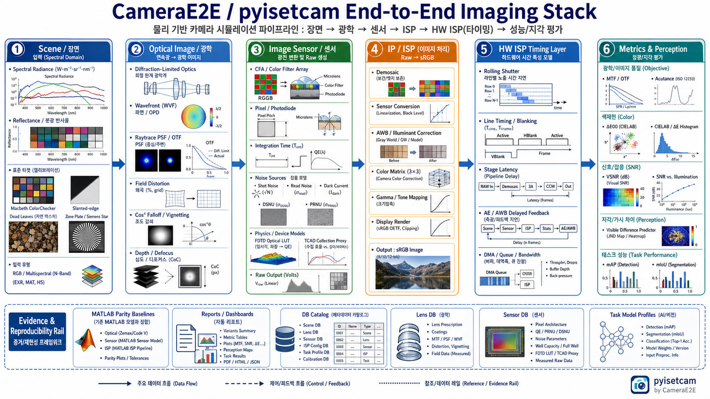
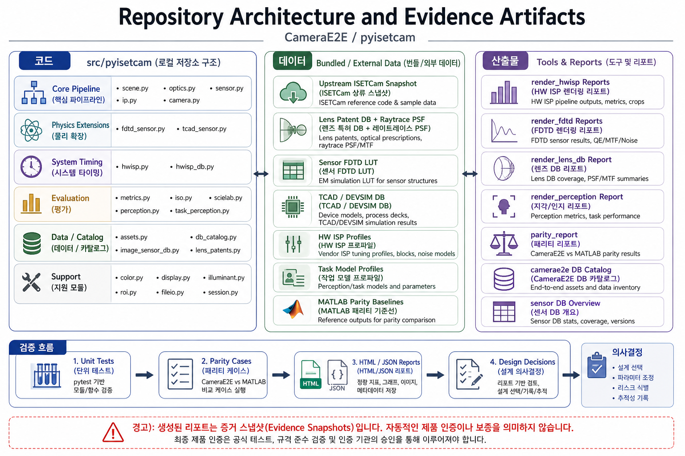
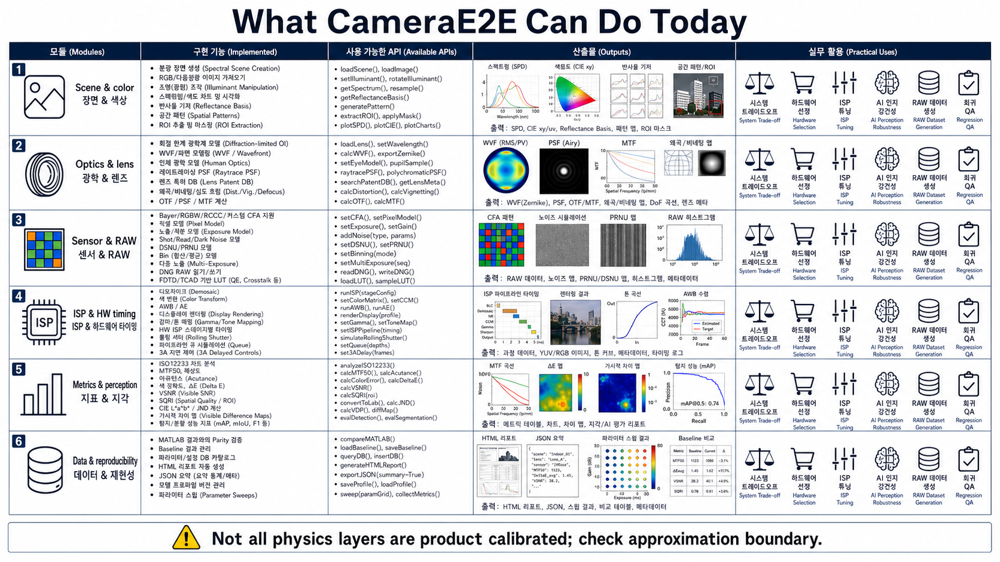
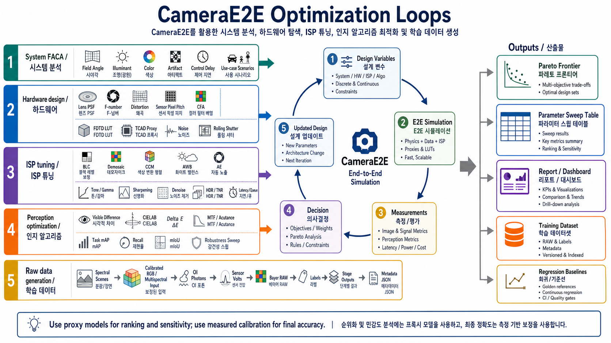
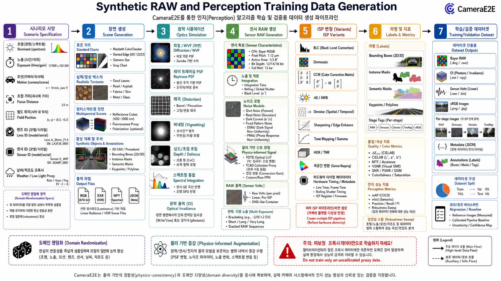
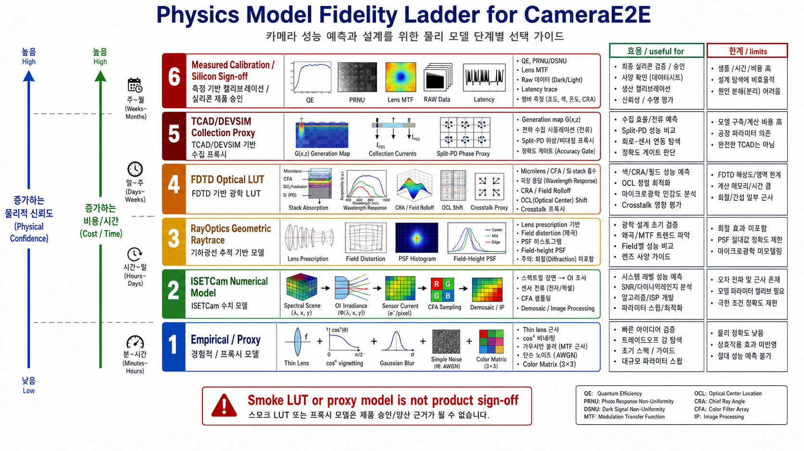

# CameraE2E 기술 구조와 활용 가능성

이 문서는 `CameraE2E` 저장소의 현재 구현 범위와 실무적으로 가능한 일을 구조적으로 설명한다. 코드 기준의 이름은 대부분 `pyisetcam` 패키지의 공개 API를 따른다. 다이어그램은 `imagegen`으로 만든 개념도이므로 이미지 안의 작은 텍스트나 함수명은 일부 오탈자가 있을 수 있다. 정확한 구현명과 판단 기준은 본문을 기준으로 본다.

중요한 전제: 현재 `system_faca.py`는 `FACA`를 `Field / Angle / Color / Artifact / Control`을 함께 보는 시스템 수준 trade-off 분석으로 구현한다. 이것은 제품 sign-off가 아니라 scene, optics, sensor, ISP, perception을 한 흐름에서 비교하기 위한 research-grade 분석 계층이다.



## 1. 전체 구조

`CameraE2E`의 핵심은 ISETCam의 수치 이미징 파이프라인을 Python 객체와 함수로 포트한 `pyisetcam`이다. 기본 흐름은 다음과 같다.

```text
Scene -> OpticalImage -> Sensor -> ImageProcessor -> Camera
```

각 객체는 `Scene`, `OpticalImage`, `Sensor`, `ImageProcessor`, `Display`, `Camera` dataclass로 표현되고, 공통적으로 `fields`, `data`, `metadata`를 가진다. 이 구조 때문에 한 단계의 물리량과 중간 산출물을 다음 단계에서 다시 쓸 수 있다. 예를 들어 장면의 spectral photons, 광학 이미지의 irradiance/photons, 센서의 volts/digital values, IP의 sensor-space/XYZ/sRGB 결과를 따로 저장하고 분석할 수 있다.

구현은 크게 여덟 축으로 나뉜다.

| 축 | 핵심 모듈 | 역할 |
|---|---|---|
| 장면과 색 | `scene.py`, `illuminant.py`, `display.py`, `color.py` | spectral scene, RGB/multispectral import, illuminant, reflectance, display calibration, color transforms |
| 광학 | `optics.py`, `lens_patents.py` | OI 계산, diffraction, WVF, raytrace PSF, vignetting, distortion, depth defocus, lens DB |
| 센서/RAW | `sensor.py`, `fdtd_sensor.py`, `tcad_sensor.py`, `image_sensor_db.py` | CFA/pixel/exposure/noise/RAW, FDTD optical LUT, TCAD collection proxy, sensor DB |
| ISP/IP | `ip.py` | demosaic, color conversion, illuminant correction, display rendering, gamma/sRGB |
| HW ISP timing | `hwisp.py`, `hwisp_db.py` | rolling shutter, stage latency, queue, DMA, AE/AWB delayed control feedback |
| 품질 metric | `metrics.py`, `iso.py`, `scielab.py` | MTF, ISO12233, acutance, Delta E, VSNR, SQRI, SCIELAB, comparison metrics |
| perception | `perception.py`, `task_perception.py` | human-visible difference, task detection/segmentation metrics, robustness sweep |
| 검증/리포트/DB | `parity.py`, `db_catalog.py`, `tools/*`, `reports/*` | MATLAB parity, HTML/JSON reports, data catalog, parameter sweeps |



## 2. Scene: spectral 장면과 입력 데이터

`Scene`은 카메라가 보는 물리 장면을 spectral/spatial 데이터로 표현한다. 일반 RGB 이미지를 바로 처리하는 단순 ISP가 아니라, 파장축을 가진 photons/radiance 기반 장면을 만들고 조명, 반사율, display calibration을 조작할 수 있는 것이 핵심이다.

구현된 주요 기능:

| 범주 | 가능한 일 | 대표 API |
|---|---|---|
| 기본 장면 생성 | Macbeth, uniform, blackbody, monochromatic, slanted bar, point array, grid, star, zone plate, dead leaves, harmonic, HDR lights 등 | `scene_create(...)` |
| 외부 입력 | RGB 이미지, monochrome, multispectral 파일 기반 scene 생성 | `scene_from_file(...)` |
| 조명 조작 | D65, equal energy, blackbody, daylight, tungsten, spatial-spectral illuminant | `illuminant_create(...)`, `daylight(...)`, `scene_adjust_illuminant(...)`, `scene_illuminant_ss(...)` |
| 반사율/차트 | Macbeth, reflectance chart, basis reconstruction, SVD basis, chart ROI | `scene_reflectance_chart(...)`, `hc_basis(...)`, `macbeth_patch_data(...)` |
| 공간/ROI | crop, translate, rotate, resample, ROI data, line profile, frequency support | `scene_crop(...)`, `scene_translate(...)`, `scene_spatial_resample(...)`, `vc_get_roi_data(...)` |
| 색/시감 변환 | luminance, XYZ, LAB/LUV, CCT, RGB/XYZ reshape | `scene_get(...)`, `luminance_from_photons(...)`, `xyz_to_lab(...)` |

이 레이어가 중요한 이유는 hardware, ISP, perception 알고리즘을 비교할 때 입력 장면을 통제할 수 있기 때문이다. 예를 들어 같은 Macbeth 장면에서 조명만 바꾸거나, 같은 slanted edge에서 pixel pitch만 바꾸거나, 같은 synthetic object에서 blur/noise만 바꿔 downstream task metric을 측정할 수 있다.

실무 활용:

- 색 정확도와 AWB 튜닝용 Macbeth/reflectance chart 생성
- MTF/edge 분석용 slanted bar, zone plate, harmonic scene 생성
- AI robustness 평가용 dead leaves, grid, synthetic object, low-light proxy 생성
- RGB 입력을 calibrated scene으로 변환해 물리 파이프라인에 넣기
- 조명/색온도/공간 조명 변화에 대한 color constancy 분석

주의할 점:

- 장면 생성은 실제 세계의 모든 BRDF, flare, motion, rolling illumination을 자동으로 재현하지 않는다.
- RGB 입력에서 spectral scene을 복원하는 경우 display/reflectance 가정에 의존한다.
- synthetic scene은 parameter sweep에는 유용하지만, training domain gap을 줄이려면 실제 raw/label과 함께 보정해야 한다.

## 3. Optics: 광학 이미지, 렌즈, PSF, field 특성

`OpticalImage` 단계는 scene radiance를 센서면 irradiance/photons로 변환한다. `oi_compute(...)`는 scene photons를 optics 설정에 따라 광학 이미지로 계산하며, diffraction, cos4 vignetting, extra blur, raytrace PSF 등을 적용할 수 있다.

구현된 주요 기능:

| 범주 | 가능한 일 | 대표 API |
|---|---|---|
| OI 생성/계산 | default, diffraction-limited, pinhole, uniform OI, human OI, WVF 기반 OI | `oi_create(...)`, `oi_compute(...)` |
| diffraction/OTF | diffraction OTF, diffraction-limited MTF, Airy disk 계열 계산 | `optics_create(...)`, `dl_mtf(...)`, `oi_calculate_otf(...)` |
| WVF/wavefront | wavefront object, Zernike, pupil, PSF/OTF 변환, human wavefront | `wvf_create(...)`, `wvf_compute(...)`, `wvf_to_oi(...)`, `wvf_to_psf(...)` |
| raytrace PSF | field height와 angle 기반 raytrace PSF 적용, OTF/PSF grid, PSF interpolation | `rt_psf_interp(...)`, `rt_psf_apply(...)`, `rt_precompute_psf(...)`, `optics_ray_trace(...)` |
| field 특성 | cos4 falloff, distortion, field height PSF, center/edge sharpness | `oi_get(...)`, `rt_geometry(...)`, `oi_spatial_support(...)` |
| depth/motion/diffuser | depth defocus, depth map combine, camera motion, diffuser, birefringent diffuser | `oi_depth_compute(...)`, `oi_camera_motion(...)`, `oi_diffuser(...)` |
| 렌즈 DB | lens patent DB 검색, prescription/surface 조회, raytrace optics 생성 | `lens_patent_search(...)`, `lens_patent_surfaces(...)`, `lens_patent_raytrace_optics(...)` |

Lens DB도 연결되어 있다. 기존 리포트 기준으로 외부 RayOptics v9 package는 427개 lens, 822개 simulation result, 584개 CameraE2E-ready row, 438개 generated raytrace PSF asset을 제공한다. bundled fallback v6 DB도 저장소 안에 들어 있다.

가능한 분석:

- center vs edge PSF/MTF 비교
- distortion grid와 radial distortion curve 분석
- F-number, focal length, field height, pixel pitch 변화에 따른 sharpness sweep
- lens 후보별 CameraE2E pipeline smoke test
- 렌즈 patent prescription을 기반으로 한 early-stage optical trade-off

중요한 한계:

- RayOptics PSF asset은 geometric ray-histogram PSF이며 diffraction이 포함되지 않는다. diffraction/WVF 모델은 별도 경로로 존재하지만, raytrace PSF와 자동으로 완전한 wave-optics sign-off가 되는 것은 아니다.
- patent caption 기반 row는 metadata/proxy 성격이 강할 수 있다.
- flare, ghost, coating, 제조 오차, stray light, sensor stack interaction은 현재 lens DB만으로 충분히 닫히지 않는다.

## 4. Image Sensor: CFA, pixel, noise, RAW, FDTD/TCAD

`Sensor` 단계는 광학 이미지 photons를 pixel/CFA sampling과 exposure/noise/quantization을 거쳐 raw voltage 또는 digital value로 바꾼다. `sensor_compute(...)`는 OI photons, sensor filter spectra, pixel area, integration time, conversion gain, noise flag 등을 사용한다.

구현된 주요 기능:

| 범주 | 가능한 일 | 대표 API |
|---|---|---|
| sensor 생성 | Bayer GRBG/GBRG/RGGB/BGGR, monochrome, monochrome array, RGBW, GRBC, RCCC, YCMY, custom, IMX 계열 seed, split pixel 등 | `sensor_create(...)`, `sensor_create_ideal(...)`, `sensor_create_split_pixel(...)` |
| pixel model | pixel size, fill factor, conversion gain, voltage swing, dark voltage, read noise, DSNU/PRNU | `pixel_create(...)`, `sensor_get(...)`, `sensor_set(...)` |
| exposure | auto exposure, integration time, multi-exposure, matrix integration time 일부 | `sensor_set(..., "integration time", ...)`, `sensor_compute_mev(...)` |
| raw response | current density, spatial integration, sensor volts, digital values, full-array compute | `sensor_compute(...)`, `sensor_compute_full_array(...)`, `sensor_compute_image(...)` |
| noise | shot noise, read noise, dark current, DSNU, PRNU, column FPN, quantization | `sensor_add_noise(...)`, `sensor_compute_noise_free(...)` |
| sampling/array | binning, sensor array, multi-sensor, SV filter, CFA plane conversion | `bin_sensor_compute(...)`, `sensor_compute_array(...)`, `sensor_compute_sv_filters(...)` |
| file IO | DNG read, image/spectra/object import/export | `ie_dng_read(...)`, `vc_read_image(...)`, `vc_export_object(...)` |

### FDTD optical LUT

`fdtd_sensor.py`는 외부 FDTD workspace의 optical response LUT를 sensor block에 붙인다. 현재 모델은 다음을 다룬다.

- wavelength-dependent optical response correction
- CRA/field response rolloff
- center-to-edge optical shading
- OCL shift 효과
- regional-response crosstalk proxy
- downstream raw volts와 ISP output 영향

대표 API:

```python
fdtd_sensor_lut_load(...)
fdtd_sensor_lut_validate(...)
fdtd_sensor_physics_validate(...)
fdtd_sensor_lut_response(...)
fdtd_sensor_qe_scale(...)
fdtd_sensor_field_response_map(...)
fdtd_sensor_lut_crosstalk_kernel(...)
sensor_attach_fdtd_lut(...)
```

지원 mode token은 `qe`, `field`, `crosstalk` 및 조합형 `qe+field+crosstalk`이다.

### TCAD/DEVSIM collection proxy

`tcad_sensor.py`는 FDTD generation map과 DEVSIM collection current summary를 읽어서 collection efficiency와 split-PD proxy를 붙인다.

대표 API:

```python
tcad_sensor_db_load(...)
tcad_sensor_validate(...)
tcad_sensor_collection_efficiency(...)
tcad_sensor_split_phase(...)
tcad_sensor_generation_map_slice(...)
sensor_attach_tcad_lut(...)
sensor_attach_physics_lut(...)
```

중요한 경계:

- 현재 FDTD DB는 optical absorption/regional response proxy 성격이 강하다.
- TCAD/DEVSIM artifacts는 generation-map ingestion, split-PD current plumbing, terminal-current balance를 보여주는 framework evidence다.
- 제품 정확도에는 measured optical stack `n,k`, implant/profile, DTI/BDTI geometry, mobility/recombination/interface calibration, QE/split/dark/lag calibration target이 필요하다.
- 기존 physics report는 grid-qualified 또는 smoke/proxy 상태를 명시하며, full resolution/time/PML convergence가 항상 닫힌 것은 아니다.

## 5. IP/ISP: image processor와 하드웨어 타이밍 모델

`ip.py`는 sensor output을 display-facing image로 렌더링하는 image processor이다. `ip_compute(...)`는 sensor data를 sensor-space RGB로 demosaic한 뒤, sensor-to-internal transform, illuminant correction, display render, gamma/sRGB 경로를 처리한다.

구현된 주요 기능:

| 범주 | 가능한 일 | 대표 API |
|---|---|---|
| demosaic | bilinear, nearest, laplacian/adaptive laplacian, RCCC, multichannel, POCS | `demosaic(...)`, `demosaic_rccc(...)`, `demosaic_multichannel(...)`, `pocs(...)` |
| defect handling | faulty pixel list, nearest/bilinear replacement | `faulty_list(...)`, `faulty_insert(...)`, `faulty_nearest_neighbor(...)` |
| color pipeline | sensor conversion matrix, ESSER transform, illuminant correction, gray-world/white-world | `image_sensor_transform(...)`, `image_sensor_correction(...)`, `image_illuminant_correction(...)` |
| display render | internal-to-display, gamma table, sRGB, display RGB | `display_render(...)`, `ie_internal_to_display(...)`, `ip_compute(...)` |
| output query | input, sensorspace, XYZ, ICS, display RGB, sRGB, result | `ip_get(...)`, `image_data_xyz(...)` |
| light field helpers | light-field buffer/image conversion and autofocus helpers | `ip_to_lightfield(...)`, `lf_autofocus(...)` |

`hwisp.py`는 여기와 구분해야 한다. HW ISP layer는 image processing algorithm 자체를 RTL처럼 재구현하는 레이어가 아니라, 기존 `camera_compute(...)` 이미지 결과 위에 timing, queue, delayed control feedback evidence를 붙이는 시스템 시뮬레이션 레이어다.

구현된 HW ISP 기능:

| 범주 | 가능한 일 |
|---|---|
| rolling shutter/readout | `request`, `exposure_start`, `exposure_mid`, `readout_start`, `readout_end` timestamp |
| stage timing | stream, line-buffer, frame-buffer stage별 start/end, latency cycle, clock, pixels-per-cycle |
| 3A feedback | delayed AE/AWB controls, H3A-like stats grid, center-weighted metering, gray-world AWB |
| transport/queue | request queue depth, max buffer, DMA/app visible timing, stall |
| reports | frame timeline, stage latency, E2E latency, AE/AWB convergence, validation verdict |
| profiles | `generic_1080p_30fps`, `rpi_vc4_imx219_public_seed` seed profiles |

대표 API:

```python
hw_isp_config(...)
hw_isp_simulate_frame(...)
hw_isp_simulate_sequence(...)
hw_isp_latency_summary(...)
hw_isp_export_json(...)
hw_isp_config_from_profile(...)
```

가능한 ISP 활용:

- AE/AWB apply delay가 image quality와 convergence에 미치는 영향 분석
- line-buffer vs frame-buffer stage의 latency sensitivity 분석
- queue depth, DMA delay, frame interval 변화에 따른 app-visible latency 분석
- ISP parameter tuning을 perception metric과 연결
- RTL/실기 trace가 있을 때 stage latency parameter를 fit하는 시스템 모델

한계:

- HW ISP profile은 seed parameter다. BSP, kernel trace, hardware counter, measured latency로 교체하기 전에는 제품 latency sign-off로 쓰면 안 된다.
- AF, HDR merge, TNR의 상세 내부 모델은 v1 범위에서 제한적이다.
- 실제 vendor ISP의 fixed-point rounding, block-specific nonlinear behavior, memory bandwidth arbitration까지 완전 재현하는 모델은 아니다.

## 6. Metrics: 이미지 품질, 인간 지각, task perception



### 6.1 전통적 image quality metric

`metrics.py`, `iso.py`, `camera.py`에는 classic image quality 분석이 들어 있다.

| 목적 | 대표 API | 산출물 |
|---|---|---|
| 기본 차이 | `comparison_metrics(...)` | MAE, RMSE, relative error, PSNR |
| 색 정확도 | `camera_color_accuracy(...)`, `macbeth_color_error(...)`, `delta_e_ab(...)`, `delta_e_2000(...)`, `delta_e_94(...)` | Macbeth patch Delta E, LAB, white point |
| sharpness/MTF | `iso12233(...)`, `edge_to_mtf(...)`, `camera_mtf(...)`, `camera_acutance(...)` | ESF, LSF, MTF, MTF50, aliasing, CPIQ acutance |
| visual SNR/SQRI | `camera_vsnr(...)`, `ie_sqri(...)`, `xyz_to_vsnr(...)` | vSNR, SQRI, light-level curves |
| spectrum/illuminant | `metrics_spd(...)`, `spectral_angle(...)`, `mired_difference(...)`, `spd_to_cct(...)` | SPD angle, CIELAB delta, mired, CCT |
| full-reference | `camera_full_reference(...)`, `scielab(...)`, `scielab_rgb(...)` | SCIELAB error map, SSIM-style summaries |

기존 parity evidence report 기준으로 selected camera-pipeline cases는 10/10 passed이고, global curated parity는 258 passed, 0 failed, 1 skipped였다. 이 리포트는 `reports/parity/camera_field_parity_report.md`에 있으며 생성 시점은 2026-04-01이다. 최신 상태의 전체 parity를 주장하려면 다시 실행해야 한다.

### 6.2 Human-visible perception

`perception.py`는 사람 눈에 보이는 차이를 viewing condition과 연결한다. 단순 RMSE 하나가 아니라 display luminance, pixel pitch, viewing distance, white point, JND threshold를 명시한 뒤 다음을 계산한다.

- image/luminance-domain MAE, RMSE, PSNR
- Delta E summary
- visible-difference map
- S-CIELAB 기반 perceptual map
- ISO acutance와 SQRI 기반 sharpness
- artifact proxy, high-frequency error fraction

대표 API:

```python
perception_config(...)
pixels_per_degree(...)
image_to_luminance(...)
perception_image_metrics(...)
perception_color_metrics(...)
perception_visible_difference_map(...)
perception_sharpness_metrics(...)
perception_artifact_metrics(...)
perception_compare(...)
```

중요한 설계 규칙은 하나의 global score로 무리하게 접지 않는 것이다. 색 오류, visible difference, sharpness, noise/artifact, temporal/control artifact는 서로 다른 failure mode다. 제품 요구사항이 weight를 정의하기 전에는 분리해서 본다.

### 6.3 Task perception

`task_perception.py`는 downstream computer vision 성능을 분석한다. detector/segmenter callable을 받거나 optional adapter를 통해 YOLO, TorchVision, Transformers DETR/Mask2Former, SAM 등을 쓸 수 있다. heavy AI framework는 core dependency가 아니다.

구현된 주요 기능:

| 범주 | 대표 API | 설명 |
|---|---|---|
| detection | `TaskBoundingBox`, `bbox_iou(...)`, `detection_metrics(...)`, `mean_average_precision(...)` | precision, recall, F1, AP, mAP |
| segmentation | `TaskSegmentationMask`, `mask_iou(...)`, `boundary_f1_score(...)`, `segmentation_metrics(...)`, `mean_iou(...)` | mask IoU, mIoU, boundary F1 |
| adapter | `task_model_config_from_profile(...)`, `task_model_from_config(...)`, `task_detector_from_config(...)` | optional model backend 생성 |
| robustness | `task_perception_sweep(...)`, `task_degradation_report(...)`, `task_perception_perturb_image(...)` | blur/noise/low-light sweep |
| stagewise scoring | `task_score_by_stage(...)` | scene/OI/sensor/IP stage별 task score 비교 |
| annotation/render | `annotations_to_bboxes(...)`, `annotations_to_masks(...)`, `render_detection_overlay(...)`, `render_segmentation_overlay(...)` | label 변환, overlay 생성 |

활용 포인트:

- ISP 튜닝이 human-visible metric뿐 아니라 mAP/mIoU에 미치는 영향 측정
- blur, noise, low-light, demosaic, sharpening, denoise 변화에 대한 detector/segmenter robustness sweep
- perception model 학습 전에 어떤 degradation이 치명적인지 선별
- model confidence와 camera pipeline parameter의 민감도 분석

한계:

- 모델 학습 loop 자체가 들어 있는 것은 아니다. 이 레이어는 adapter, metric, sweep, report를 제공한다.
- synthetic/perfect label 기반 성능은 실제 데이터 성능을 보장하지 않는다.
- optional model backend는 별도 package와 model weight가 필요하다.

## 7. 데이터와 리포트 재현성

CameraE2E는 단순 library API뿐 아니라 evidence artifact를 많이 만든다.

| 영역 | 산출물 |
|---|---|
| DB catalog | `reports/db_catalog/camerae2e_db_catalog.html`, `.json` |
| lens DB | `reports/lens_db/lens_db_camerae2e_report.html`, summary JSON, PSF/company readiness figures |
| sensor DB | `reports/sensor_db/sensor_db_overview.html`, sensor structure/TCAD/FDTD impact images |
| FDTD/TCAD | `reports/fdtd_sensor/*report.html`, response/crosstalk/kernel/physics figures |
| HW ISP | `reports/hwisp/index.html`, timeline, stage latency, AE/AWB convergence, parameter requirement report |
| parity | `reports/parity/latest.json`, camera field parity report and figures |
| perception | `reports/perception/perception_report.html`, visible difference, sharpness figure, summary JSON |
| task perception | `reports/perception/task_perception/task_perception_report.html`, overlays, sweep figure, summary JSON |

`db_catalog.py`는 lens, sensor, HW ISP, task model, upstream asset, parity baseline을 하나의 searchable catalog로 노출한다.

대표 API:

```python
camerae2e_db_catalog(...)
camerae2e_db_search(...)
camerae2e_db_get(...)
camerae2e_db_parameters(...)
camerae2e_db_summary(...)
```

이 구조는 parameter source와 report artifact를 연결해준다. 예를 들어 lens 후보를 DB에서 고르고, 그 후보의 raytrace PSF를 optics에 붙이고, sensor FDTD LUT와 HW ISP profile을 조합한 뒤, perception/task metric report를 생성하는 식의 반복 실험이 가능하다.

## 8. 무엇이 가능한가



### 8.1 시스템 FACA 또는 E2E trade-off 분석

`system_faca.py`는 FACA를 `Field / Angle / Color / Artifact / Control`로 정의하고, scenario/sweep 실행 결과를 stage별 image/raw 요약, scalar metric, artifact lineage, random seed와 함께 기록한다. 이 계층으로 다음 질문을 다룰 수 있다.

- Field: center/edge/corner에서 PSF, MTF, distortion, vignetting이 어떻게 변하는가?
- Angle: CRA, OCL shift, field response, FDTD LUT가 raw와 sRGB에 어떤 영향을 주는가?
- Color: illuminant, CFA, CCM, AWB, display white point가 Delta E와 visible difference에 어떤 영향을 주는가?
- Artifact: demosaic artifact, high-frequency error, noise, PRNU/DSNU, sharpening/denoise trade-off는 어떤가?
- Control: AE/AWB delay, request queue, rolling shutter timing이 frame-level quality와 latency에 어떤 영향을 주는가?

가능한 산출물:

- parameter sweep table
- center/edge metric 비교
- Pareto frontier, 예: MTF50 vs Delta E vs latency vs mAP
- regression baseline
- HTML/JSON report
- stage별 failure attribution

### 8.2 하드웨어 탐색

가능한 하드웨어 탐색:

- lens 후보별 PSF/MTF/distortion/vignetting 비교
- F-number, focal length, HFOV, field height에 따른 센서면 sharpness 분석
- pixel pitch, CFA pattern, read noise, conversion gain, voltage swing 변화에 따른 RAW/SNR 분석
- FDTD LUT로 CRA/field/OCL 영향 분석
- TCAD proxy로 collection efficiency와 split-PD proxy 비교
- rolling shutter line time, exposure, frame rate, queue depth에 따른 latency 분석

좋은 사용법:

1. lens/sensor 후보를 DB catalog에서 고른다.
2. scene set을 고정한다. 예: Macbeth, slanted edge, dead leaves, task object scene.
3. lens/sensor/ISP/HW ISP parameter를 sweep한다.
4. raw metric, image metric, perception metric, task metric을 같이 본다.
5. 유망 후보만 실측 또는 고충실도 simulation으로 올린다.

한계:

- 현 상태만으로 silicon/lens vendor sign-off를 대신할 수 없다.
- FDTD/TCAD는 calibration과 convergence 경계를 반드시 확인해야 한다.
- lens patent DB의 raytrace PSF는 diffraction/coating/stray-light까지 완전 포함하지 않는다.

### 8.3 ISP 튜닝

가능한 ISP 튜닝:

- demosaic method 변경에 따른 color/sharpness/task metric 비교
- CCM, sensor conversion, illuminant correction, AWB rule 변경
- AE target, AE clamp, AWB gains, apply delay frames 변경
- denoise/sharpening/tone/gamma proxy를 넣고 human-visible 및 task metric 비교
- line-buffer/frame-buffer stage latency가 app-visible timing에 미치는 영향 분석
- IP result와 HW ISP timing metadata를 함께 리포팅

특히 `hwisp.py`는 이미지 품질 값만 보는 것의 한계를 보완한다. 실제 시스템에서는 같은 frame quality라도 `언제` 결과가 앱에 보이는지, 어떤 frame의 AE/AWB stats가 언제 적용되는지가 중요하다. 이 레이어는 그 지연을 deterministic metadata로 기록한다.

### 8.4 Perception 알고리즘 최적화

가능한 분석:

- detector/segmenter 성능을 raw degradation 및 ISP tuning과 연결
- stage별 이미지, 예: reference, OI, sensor-space, IP output에서 task score 비교
- blur/noise/low-light robustness sweep
- visible difference와 mAP/mIoU 손실의 상관 분석
- 특정 object size, edge contrast, illuminant condition에서 성능 저하 원인 분해

예:

```text
lens edge PSF worsens -> small object edge contrast drops -> demosaic/sharpening changes -> visible difference increases -> detector recall drops
```

이런 chain을 하나의 실험에서 만들 수 있는 것이 CameraE2E의 강점이다.

### 8.5 Perception 학습용 RAW 데이터 생성



CameraE2E는 학습 engine은 아니지만 raw data generation pipeline으로 쓸 수 있다.

생성 가능한 데이터:

- spectral scene photons
- optical image photons/irradiance
- sensor volts
- Bayer/CFA RAW proxy
- multi-exposure 또는 exposure sweep
- IP 중간 산출물: input, sensor-space, XYZ, corrected internal, display RGB, sRGB
- detection/segmentation label과 overlay
- lens/sensor/ISP/HW timing metadata JSON
- metric summary: MTF, acutance, Delta E, SCIELAB, VSNR, mAP, mIoU

가능한 workflow:

1. scene와 label을 정의한다. 예: synthetic object, bounding boxes, masks.
2. lens/sensor/ISP/HW profile을 sampling한다.
3. `camera_compute(...)` 또는 explicit stage compute로 raw/stage images를 저장한다.
4. `task_perception_sweep(...)`로 degradation case를 만든다.
5. metadata와 label을 함께 저장해 train/val/test split을 만든다.
6. 실제 raw dataset과 distribution을 비교하고 calibration parameter를 조정한다.

중요한 주의:

- uncalibrated proxy data만으로 model을 학습하면 domain gap이 생긴다.
- synthetic data는 rare case coverage, ablation, robustness augmentation에는 강하지만, 최종 성능은 measured raw와 함께 검증해야 한다.
- label은 scene 생성 규칙과 연결되므로, 실제 annotation noise와 occlusion complexity를 별도로 고려해야 한다.

## 9. Physics 근사의 효용과 한계



### 9.1 효용

Physics 근사는 완벽한 현실 재현이 목적이 아니라, 설계 결정을 빠르게 좁히고 failure mode를 분해하기 위한 도구다.

효용은 다음이 크다.

| 효용 | 설명 |
|---|---|
| causal decomposition | scene, optics, sensor, ISP, perception 중 어느 단계가 metric 손실을 만드는지 분리할 수 있다. |
| sensitivity analysis | pixel pitch, lens PSF, CRA, noise, AWB delay 같은 parameter의 민감도를 볼 수 있다. |
| early hardware ranking | 실제 silicon/lens 샘플 없이 후보군을 줄일 수 있다. |
| controlled dataset generation | 같은 scene에서 한 parameter만 바꾸는 데이터셋을 만들 수 있다. |
| regression QA | MATLAB parity, report JSON, fixed baselines로 변경 영향을 추적할 수 있다. |
| measurement planning | 어떤 실측이 최종 정확도에 가장 중요한지 먼저 알 수 있다. |

특히 CameraE2E는 `spectral scene -> optics -> sensor -> IP -> perception/task metric`을 한 흐름으로 연결하므로, 단일 블록 metric이 아니라 downstream impact를 볼 수 있다. 예를 들어 lens edge PSF 차이가 raw edge contrast, demosaic artifact, SCIELAB map, detector recall까지 어떻게 전파되는지 추적할 수 있다.

### 9.2 한계

한계는 모델 레벨마다 다르다.

| 모델 레벨 | 효용 | 한계 |
|---|---|---|
| empirical/proxy | 빠르고 sweep하기 쉽다. trend와 sensitivity 파악에 좋다. | 원인 물리가 생략되므로 절대값 신뢰도는 낮다. |
| ISETCam numerical pipeline | spectral scene, OI, sensor, IP 연결성이 좋다. MATLAB parity로 검증된 영역이 있다. | 현실의 모든 lens/sensor/ISP vendor behavior를 자동 포함하지 않는다. |
| RayOptics geometric PSF | lens prescription, field-dependent PSF, distortion 분석에 좋다. | geometric ray histogram이며 diffraction, coating, flare, manufacturing tolerance가 제한적이다. |
| FDTD optical LUT | microlens/CFA/Si stack, wavelength/CRA/field response를 더 물리적으로 볼 수 있다. | LUT grid, source time, PML, material `n,k`, stack geometry, convergence에 민감하다. |
| TCAD/DEVSIM proxy | generation map과 collection current plumbing을 연결한다. | calibrated electrical sensor model이 아니면 제품 collection/QE/dark/lag sign-off가 아니다. |
| measured calibration | 최종 제품 정확도에 필요하다. | 비용과 시간이 크고, design space 전체를 훑기 어렵다. |

### 9.3 올바른 사용 원칙

CameraE2E를 좋은 solution으로 쓰려면 다음 경계를 지켜야 한다.

1. Proxy model은 ranking과 sensitivity 용도로 쓴다.
2. 제품 sign-off에는 measured calibration 또는 vendor trace를 붙인다.
3. report에 model source, calibration 상태, convergence 상태를 함께 남긴다.
4. 하나의 global score로 모든 품질을 덮지 않는다.
5. human-visible metric과 task metric을 같이 보되, 서로 대체하지 않는다.
6. synthetic RAW 학습 데이터는 실제 RAW와 distribution alignment를 확인한다.
7. optics, sensor, ISP, perception 중 하나만 좋아지는 tuning이 전체 시스템에 좋은지 반드시 E2E로 확인한다.

## 10. 추천 사용 시나리오

### 시스템 trade-off 리포트

```text
입력:
  scene set: Macbeth, slanted edge, dead leaves, task object
  lens candidates: DB에서 3-10개
  sensor configs: pixel pitch, CFA, noise, FDTD LUT mode
  ISP configs: demosaic, CCM/AWB, sharpening/denoise proxy
  HW configs: fps, line_time, queue depth, AE/AWB delay

실행:
  explicit pipeline 또는 camera_compute
  hw_isp_simulate_sequence
  camera_mtf, camera_acutance, camera_color_accuracy
  perception_compare
  task_perception_sweep

출력:
  raw/stage images
  metric table
  latency table
  visible difference map
  mAP/mIoU robustness plot
  recommended candidate list
```

### ISP 튜닝 리포트

```text
고정:
  lens, sensor, scene set

변경:
  demosaic method
  CCM/AWB method
  AE target and delay
  sharpening/denoise/tone proxy

판정:
  Delta E, SCIELAB, MTF50, acutance, artifact proxy
  task mAP/mIoU
  app-visible latency and AE/AWB settle frame
```

### Raw 데이터 생성 리포트

```text
생성:
  scene photons
  OI photons
  sensor volts
  Bayer RAW proxy
  IP outputs
  labels and metadata JSON

검증:
  distribution check against measured RAW
  visible difference and task degradation
  model-source/caveat manifest
```

## 11. 구현 업데이트: registry, FACA, RAW data factory

PPT에서 설명한 활용 범위를 코드에서 직접 추적하기 위해 public API가 추가되었다.

| 영역 | API | 역할 |
|---|---|---|
| DB/LUT registry | `camerae2e_db_manifest()`, `camerae2e_db_validate(...)`, `camerae2e_db_lineage(...)` | asset provenance, readiness tier, dependency, stale artifact를 한 manifest에서 추적 |
| Physics pipeline plan | `camerae2e_physics_pipeline_plan(...)` | FDTD/TCAD/RayOptics/HW ISP asset의 stale/missing/proxy 상태를 refresh/calibration action list로 변환 |
| System FACA | `camerae2e_run_scenario(...)`, `camerae2e_run_sweep(...)`, `camerae2e_faca_report(...)` | Field / Angle / Color / Artifact / Control 관점의 E2E scenario와 sweep 결과 수집 |
| Parameter optimization | `camerae2e_optimize_parameters(...)`, `camerae2e_optimization_report(...)` | `sensor.integration_time`, `sensor.analog_gain`, `optics.fnumber`, `ip.demosaic_method` 같은 dot-path camera parameter를 FACA metric objective/constraint로 자동 grid search |
| RAW data factory | `camerae2e_dataset_export(...)` | perception 학습용 RAW NPZ, RGB preview, labels JSON, metadata JSONL, manifest export |

새 readiness tier는 `missing`, `available`, `proxy`, `validated`, `calibration_required`, `calibrated`로 통일한다. 이 tier는 기능의 존재 여부가 아니라 claim의 강도를 나타낸다. 예를 들어 RayOptics PSF가 실행 가능해도 diffraction/wave-optics sign-off는 아니므로 `proxy`에 머문다. TCAD framework가 로드되어도 measured process/optical/electrical calibration이 없으면 `calibration_required`에 머문다.

현재 goal-readiness report는 다음 명령으로 갱신한다.

```bash
python tools/render_camerae2e_asset_registry_report.py
```

외부 physics pipeline의 lineage check는 다음 명령으로 실행한다.

```bash
python tools/validate_camerae2e_physics_pipeline.py
```

## 12. 결론

CameraE2E는 현재 다음을 한 저장소에서 연결한다.

- spectral scene와 calibrated display/illuminant/color 처리
- diffraction/WVF/raytrace 기반 optical image
- CFA/pixel/exposure/noise 기반 sensor raw simulation
- FDTD/TCAD-informed sensor proxy
- demosaic/color/AWB/display rendering 기반 IP
- rolling-shutter/queue/stage/3A delay 기반 HW ISP timing
- ISO/MTF/acutance/Delta E/SCIELAB/VSNR/SQRI metric
- human-visible perception과 task detection/segmentation metric
- lens/sensor/HW ISP/task model DB catalog와 HTML/JSON evidence report

가장 강한 용도는 최종 sign-off가 아니라 E2E 설계 탐색, 민감도 분석, regression QA, ISP/perception co-optimization, synthetic RAW/label 데이터 생성이다. 최종 제품 정확도에는 각 물리 layer의 calibration과 measured validation을 붙여야 한다. 이 경계를 명확히 지키면 CameraE2E는 optics, sensor, ISP, perception을 따로 보는 것보다 훨씬 빠르게 시스템 병목과 trade-off를 찾는 도구가 된다.
